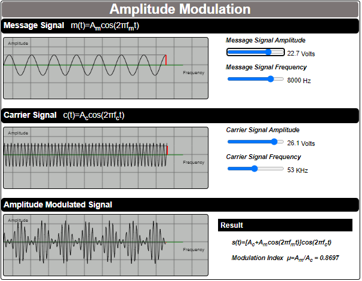
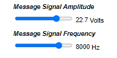
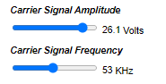
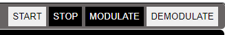
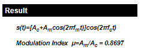

## <b>These procedure steps will be followed on the simulator</b>

1. After reading the theory and attending the pretest, click the "Simulation" tab 

2. The interactive simulator will be displayed 
    
3. Set the Message Signal Amplitude and Frequency 
    
4. Set the Carrier Signal Amplitude and Frequency 
    
    
    
5. Click on "Modulate" button. This will Show the Modulated Message Signal. 
6. Click on "Demodulate" button. This will Show the Demodulated Message Signal. 
7. Click on "Stop" button to view the graph in a Static state 
8. In the Results Section you can view the modualtion Index and type of modulation (with respect to modulation index) 
    
9.The posttest questions will be displayed,attempt the questions to check the understanding about the experiment. 
10. Note the conclusions from the experiment performed. 
