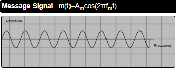
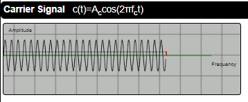
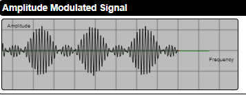
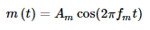
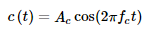
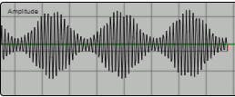
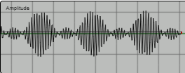

## <b> INTRODUCTION</b>  

### Amplitude modulation is a technique used in communication, most commonly for transmitting messages with a radio carrier wave.

### In amplitude modulation, the amplitude of the carrier wave is varied with accordance to that of the message signal.

---

## <b>CONCEPT</b> 

### Modulation is the process in which  characteristics of a high frequency carrier signal is varied in accordance with a messange signal.The output of the modulation process is called as the modulated signal.

---

## <b>AMPLITUDE MODULATION WAVE FORMS</b> 

---

 

  
  
  
 
Where  and  are mathematical expression for
<i>modulating and Carrier Signal</i>. 
 
The modulation Index can be Calculated Using the Formulae
 
  

<b>Under Modulation</b>  

### If the modulation Index value is less than 1,then the modulated output would look like the following figure. 

  
 
<b>Over Modulation</b>  

### If the value of the modulation index is greater than 1,then the wave will be an over-modulated wave.  

 

Take the pretest to Check your Understanding till know
