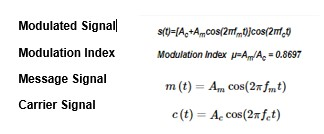
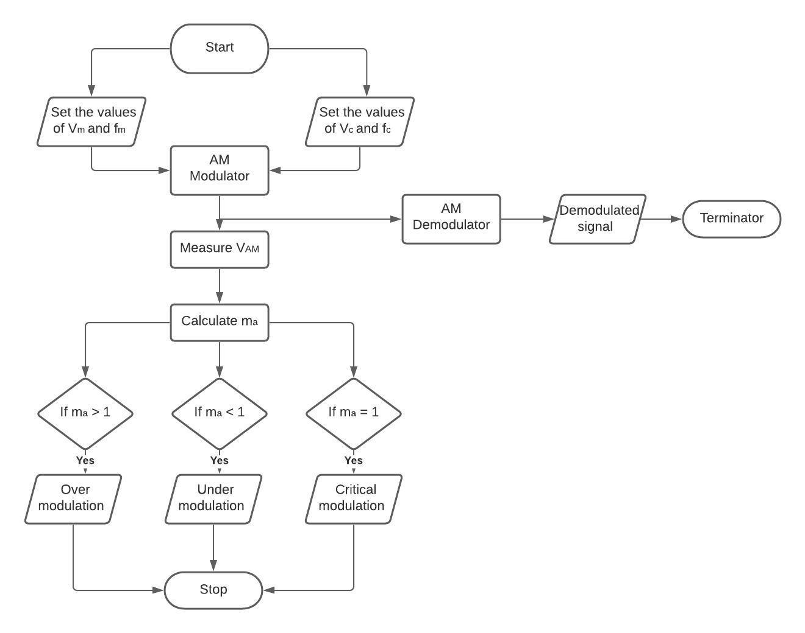
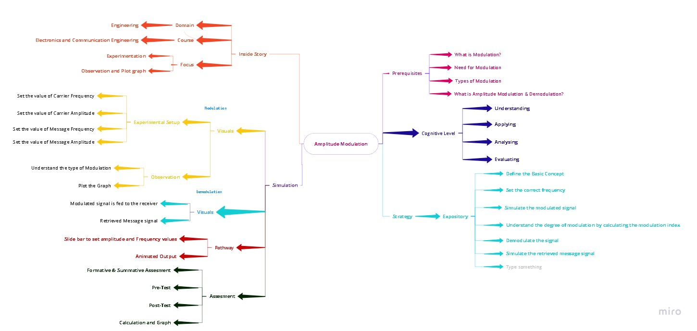
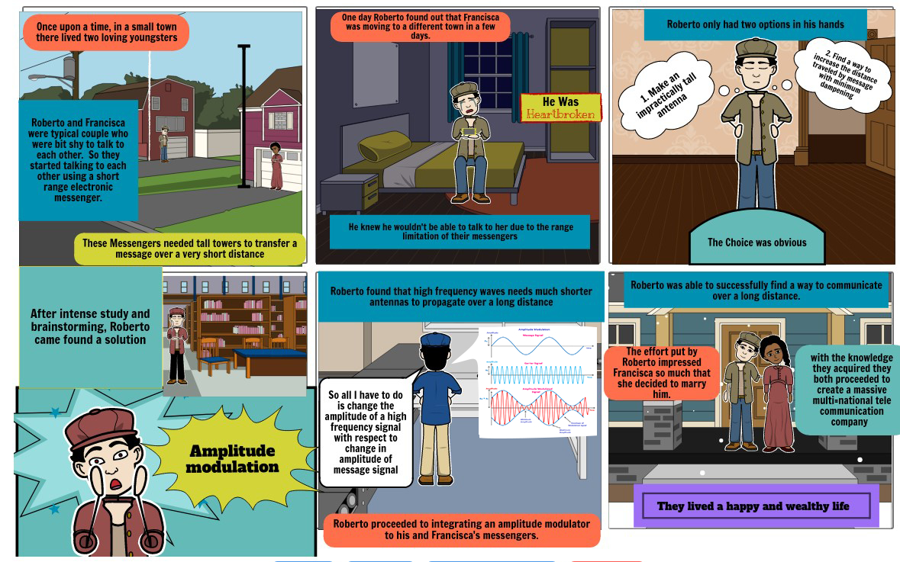

**Round 2**

**Amplitude Modulation and Demodulation**

1. **Story Outline**

The user simulates the experiment to interpret the working of the Amplitude modulation and Demodulation. The user tries to send message without the carrier signal and realise the problems in sending message signal. Then the user is allowed to set the amplitude and frequency of carrier and message signal to generate the modulated signal which clearly shows the need for modulation. The amplitude and frequency of modulated wave form can be measured to generate the demodulated message signal on the other side.

1. **Story**

The story is about two characters Roberto (Transmitter) and Francisca (Receiver) separated by a short distance. They were exchanging messages using tall antennas for a short distance. Francisca (Receiver) moved to a different city which is far away from Roberto (Transmitter). Roberto (Transmitter) tries to exchange message but cannot be possible due to impractical size of antenna and noise. Then Roberto finds a solution Amplitude modulation, which modulates the message signal using a carrier signal on the transmitter side and demodulates the message signal from the carrier signal on the receiver side.

1. **Set the Visual stage Description**

When the user opens the simulator, before the actual experiment starts the simulator explains the need for modulation with two characters Roberto and Francisca. They transmit messages successfully when they are separated by short distance and messages fails when they try to send message from long distance. After brainstorming, Transmitter finds a solution, Amplitude modulation. Then the simulator ask the following values from the user

- Set the carrier frequency
- Set the carrier amplitude
- Set the message frequency
- Set the message amplitude

Now the user can see the modulated waveform based on the values given and also the type of modulation is pop out on the screen. The user can measure the frequency and amplitude of the modulated waveform and can now press the button Transmit

After transmit is given, the modulated waveform reaches the receiver and the demodulation process will start. When the user press the receive button, the receiver can receive the actual message signal transmitted.

1. **Set user objectives and goals**

After doing the simulation, the user will be able to

| **Learning Objectives**                                                            |
| ---------------------------------------------------------------------------------- |
| Interpret the need for Modulation                                                  |
| Choose the proper values of Frequency and amplitude of Carrier and Message signal. |
| Analyse the various types of modulation based on the values given                  |
| Evaluate the modulation and demodulation process                                   |

Goal:

The Primary goal of the simulation is to interpret Amplitude modulation and Demodulation process and also enhancing the logical skills of the users.

1. **Set the Pathway activities**

- Initially the simulator shows the goals and objectives of the experiment, to start the experiment the user has to click the start simulation button
- Then the story board pops out for explaining the need for modulation
- After the explanation, the evaluation will start in which user can select the correct answers by clicking it and submit the answers
- Now the simulator will show the screen to input the frequency and amplitude of the carrier and message signal
- After giving inputs, press the simulate button
- Now the modulated waveform will be displayed on the screen and user can press transmit button to start the demodulation process
- The modulated signal will be transmitted to the receiver side and once Receive button is pressed on the receiver side, the message signal will be separated from the modulated signal
- The process can be repeated by giving different inputs and the results can be tabulated.

  1. **Set Challenges and Questions / Complexity /Variations in Questions**

  **Post test**

Q 1. \_\_\_\_ occurs when the amplitude of the message signal is greater than the amplitude of the high frequency signal? 
<b>a. Distortion </b>
b. Decay 
c. Amplification 
d. Attenuation  

Q 2.When does over-modulation occur? 
a. Modulating signal voltage <mark Carrier voltage 
b. Modulating signal voltage = Carrier voltage 
<b>c. Modulating signal voltage > Carrier voltage </b>
d. Modulating signal voltage =0 

Q 3.What is the modulation index value if Vmax=4.7v and Vmin=2.2v? 
<b>a. 0.362 </b>
b. 0.5 
c. 0.425 
d. 0.14 

Q 4.Modulation of the message is done at the **\_** 
a. Receiver 
<b>b. Transmitter </b>
c. InBetween transmitter and radio receiver 
d. None of the Above 

Q 5. In an AM wave message signal's power is carrier by \_\_\_  
a. Carrier 
<b>b. Sidebands </b>
c. Both sidebands and carrier 
d. None of the options 

**Pre Test**
Q 1. Amplitude modulation is **\_** 

<b>a. the process of changing the amplitude of the carrier with respect to the modulating signal </b>
b. the process of changing the frequency of the carrier With respect to to modulating signal 
c. the process of changing the amplitude of the modulating signal With respect to to carrier signal 
d. the process of changing the amplitude of the carrier With respect to to modulating signal frequency 

Q 2. **\_** signal is used in this type of modulation.

<b>a. High frequency</b> 
b. Low frequency 
c. High amplitude 
d. Low amplitude 

Q 3.The ratio of **\_\_\_** to the **\_\_\_** is called Modulation index of an AM signal. 

a. Peak carrier signalamplitude, Peak modulating signal amplitude 
<b>b. Peak modulating signal amplitude, Peak carrier signal amplitude</b> 
c. Carrier signal frequency, modulating signal frequency 
d. modulating signal frequency, Carrier signal frequency 

Q 4 . What is the need of Modulation? 

a. To reduce the length of Antenna 
b. Transmitting signal to longer distance 
c. Reducing the attenuation of the Signal 
<b>d. All of the Above</b> 

Q 5 .**\_\_\_** wave is used in this amplitude modulation Technique ? 

a. Square 
b. Triangluar 
<b>c. Sinusoidal </b> 
d. Swatooth 

---

**Conclusion** 
On an average it takes the user 30min-45mins to go through all the contents given such as theory , procedure ,pre-test, simulate the experiment and finally taking up the post-test.

---

<b>2.7 Equations/formulas:</b>  

 

### 3. Flowchart  

 

### 4. Mindmap: 

 

### 5. Storyboard :

 
